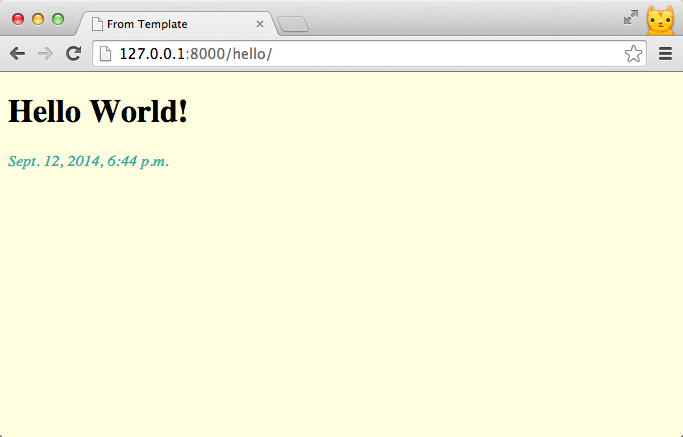

# Templates

## 加上 HTML / CSS & 動態內容

上一章的例子，只是很簡單的顯示一行字串。讓我們加上一些 HTML/CSS 美化網頁，並動態顯示每次進來這個頁面的時間:

```
# trips/views.py

from datetime import datetime
from django.http import HttpResponse


def hello_world(request):
    output = """
        <!DOCTYPE html>
        <html>
            <head>
            </head>
            <body>
                Hello World!
                <em style="color:LightSeaGreen;">{current_time}</em>
            </body>
        </html>
    """.format(current_time=datetime.now())

    return HttpResponse(output)
```
1. `"""`是用來包住長字串的寫法，這裡我們使用它來包住 HTML 語法。
2. 為了顯示動態內容，我們 import [datetime](https://docs.python.org/3.1/library/datetime.html) 時間模組，並用`datetime.now()`取得現在的時間。
3. [format()](https://docs.python.org/3/library/string.html#string-formatting) 是一個相當實用的內建 method，不用 import 就可以使用。在這裡，我們利用它幫我們把 datetime.now() 產生的值，塞進字串裡`{current_time}`的位置。

如果你的 web server 沒有關閉，在瀏覽器輸入 [http://localhost:8000/hello/](http://localhost:8000/hello/) 後，會發現網頁不只變比較漂亮，還多了現在的時間。( 你可以重新載入同一個頁面試試 )


## 建立 templates 資料夾

雖然前一個例子，我們把 HTML/CSS 放在 View function 裡，但通常為了可讀性，以及分工方便，我們會把前端的程式碼切割出來，獨立於 `templates` 資料夾裡。

請在你的 Django project 資料夾 ( djangogirls/mysite/ ) 底下創建一個新的資料夾 `templates`：

( 如果不想關閉 web server，可以再開新一個新的終端機視窗 )

```
(VENV) ~/djangogirls/mysite$ mkdir templates
```

在其資料夾底下另外新增一個 HTML 檔案`hello_world.html`，檔案結構如下：

```
├── mysite
├── templates
│   └── hello_world.html
├── trips
└── manage.py
```

接下來，我們把之前寫在 View function 裡的 HTML 程式碼搬進`hello_world.html`，為了區別，我們做了一些小小的調整：
```
<!DOCTYPE html>
<html>
    <head>
        <title>I come from template!!</title>
        <style>
            body {
               background-color: lightyellow;
            }
            em {
                color: LightSeaGreen;
            }
        </style>
    </head>
    <body>
        <h1>Hello World!</h1>
        <em>{{ current_time }}</em>
    </body>
</html>

```
- `{{ current_time }}`：請特別注意，關於變數`current_time`，我們改成使用雙括號 - `{{ }}`包起來
，這是 Django Templates 在顯示變數時使用的語法。( 其他常用的語法，我們會在後面的章節練習到。 )

## render

在 View function 搬移了混亂的 HTML 程式碼後，我們只需將 return 稍作修改：

```
# trips/views.py

from datetime import datetime
from django.shortcuts import render


def hello_world(request):
    return render(request,
                  'hello_world.html',
                  current_time=datetime.now())
```
- [render(request, template_name, dictionary)](https://docs.djangoproject.com/en/dev/topics/http/shortcuts/#render)：等同於 [render_to_response()](https://docs.djangoproject.com/en/dev/topics/http/shortcuts/#django.shortcuts.render_to_response)，結合 template 和要傳入的 dictionary，並回傳 Http Response 物件。

重新載入 [http://localhost:8000/hello/](http://localhost:8000/hello/)，你會發現畫面有了小小的改變：


