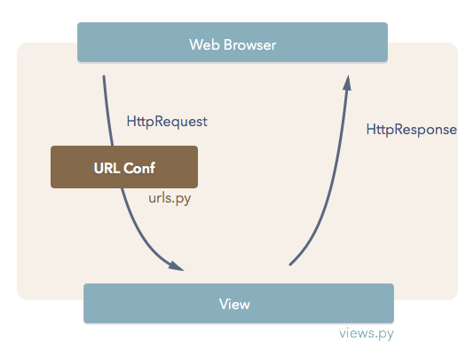
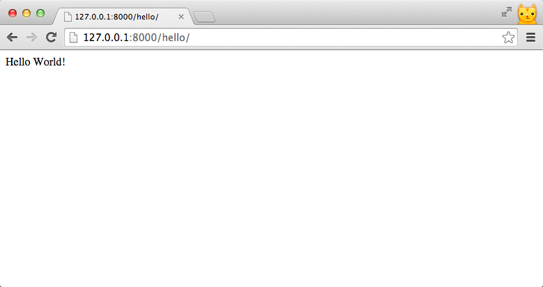

# Views and URLconfs



在前面的介紹，我們有提到 Django 的 MTV 架構。主要的過程如下：
1. 瀏覽器送出 **Http Request**
2. Django 依據 **URL Conf** 分配至對應的 View
3. View 進行資料庫的操作或其他運算，並回傳 Http Response 物件
4. 瀏覽器依據 **Http Response**，顯示網頁畫面

---

這一章，我們將透過 **Hello World** 範例 ，瞭解 Django 如何處理一個 request 的流程。

---

## Django Views

- Django 從網頁接收到 request 後，會將 request 中的資訊封裝產生一個 [HttpRequest](https://docs.djangoproject.com/en/dev/ref/request-response/#httprequest-objects) 物件，並當成第一個參數，傳入對應的 View function (`hello_world`)。

- 在 Django 的 View 中，需要回傳 [HttpResponse](https://docs.djangoproject.com/en/dev/ref/request-response/#httpresponse-objects) 物件
    - HttpResponse 物件裡面包含：
        - `HttpResponse.content`
        - `HttpResponse.status_code` ...等


首先，在`views.py`輸入下列程式碼：

```
# trips/views.py

from django.http import HttpResponse


def hello_world(request):
    return HttpResponse("Hello World!")

```

以上程式在做的事就是：
1. 從 django.http 模組中引用 `HttpResponse` 類別
2. 宣告 **hello_world** 這個 View
3. 當 **hello_world** 被呼叫時，回傳包含字串 `Hello World!` 的 **HttpResponse** 物件，

## Django Urls

最後，Django 需要知道 **URL 與 View 的對應關係**。

例如：

有人瀏覽 http://localhost:8000/hello/ ，`hello_world()` 這個 view function 需要被執行。

而這個對應關係就是 `URL conf` (URL configuration)。

---

**URL Conf **

- 通常定義在`urls.py`
- 是一連串的規則 (url pattern)
- Django 收到 request 時，會一一比對 URL Conf 中的規則，決定要執行哪個 view function
---

現在我們來設定，Hello World 範例的 URL Conf：

打開 startproject 時自動產生的`urls.py`，在 urlpatterns 當中加入以下程式：

```
# mysite/urls.py

urlpatterns = patterns('',
    ...
    url(r'^hello/$', 'trips.views.hello_world'),
)
```
以上程式透過 [url()](https://docs.djangoproject.com/en/1.7/ref/urls/#django.conf.urls.url) function 傳入兩個參數 `regex`, `view`：

    url(regex,view)

- **regex ** -- 定義的 URL 規則
  - 規則以 regular expression 來表達
  -  *r'^hello/$'* 代表的是 `/hello/` 這種 URL
- **view** -- 對應的 view function
  - 指的是 `hello_world()` 這個 view
  - *'trips.views.hello_world'* -- `trips` 裡的 `views.py` 中的 `hello_world()` function


## 測試 Hello World
現在，啟動你的 web server。 ( 如果剛剛沒關閉的話，通常 Django 會在你修改程式碼後，自動重新啟動 web server )
```
python manage.py runserver
```
在瀏覽器輸入 [http://localhost:8000/hello/](http://localhost:8000/hello/)，你會看到網頁顯示我們在 HttpResponse 傳入的文字`Hello World!`。


