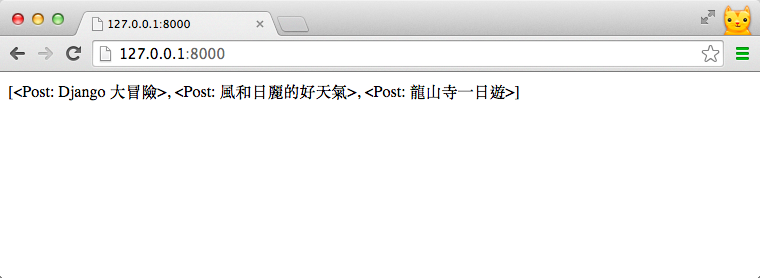
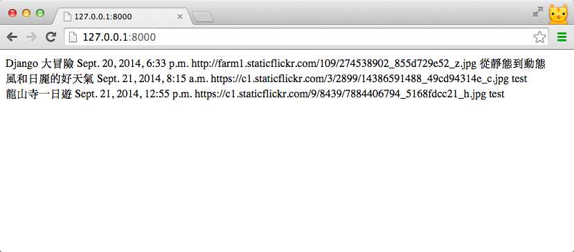

# Template tags

在先前的 Templates 章節中，我們已經學會基礎的 Django Template 用法 (在 Template 裡呈現變數內容)。但為了產生完整的網頁，我們會需要能在 Template 裡執行一些簡單的 Python 語法，例如：
- **邏輯判斷** (if else)  -- 若使用者己經登入，則顯示使用者的暱稱；若未登入，則顯示登入按鈕
- **重覆 HTML 片段** (for loop) -- 列出所有好友的ID 和顯示圖片
- **格式化 Template 中的變數** -- 例如日期的格式化

因為我們[Django template tags](https://docs.djangoproject.com/en/dev/ref/templates/builtins/) 讓你可以在 HTML 檔案裡使用類似 Python 的語法，動態存取 View 傳過來的變數，或是在顯示到瀏覽器之前幫你做簡單的資料判斷、轉換、計算等等。

---

在這一章，我們將到使用 Django ORM 存取資料庫 ，撈出旅遊日記全部的 Post 傳入 Template。並使用 Django 的 Template Tag 、Template Filter 一步步產生旅遊日記的首頁。

---
## 建立旅遊日記的首頁

### 確認首頁需求
在開始動工之前，我們先確認需求。

旅遊日記的首頁應該會有：
1. 標題
2. 照片
3. 發佈日期
4. 部份的遊記內文


### 建立首頁的 View
首先，我們先建立一個新的 View function - `home()`：

```
# trip/views.py

from django.shortcuts import render
from trip.models import Post


def home(request):
    # get all the posts
    post_list = Post.objects.all()

    return render(request,
                  'home.html',
                  {'post_list': post_list})
```

- **匯入所需的 Model** -- 記得 import 需要用到的 Model `Post`
- **取得所有Post** -- 透過`Post.objects.all()`，從資料庫取得全部的 post ，並回傳至 `home.html` 這個 template。

### 設定首頁的 Url
接下來，我們修改 **urls.py** ，將首頁 ( 正規表達式`^$` ) 指向 **home()** 這個 View function：

```
# mysite/urls.py

urlpatterns = patterns('',
    ...
    url(r'^$', 'trip.views.home'),
)
```

## Template tags

### 建立首頁的 Template 並印出 post_list

首先，在 templates 資料夾底下新增 `home.html`：

```
# templates/home.html

{{ post_list }}
```


打開瀏覽器進入首頁 [http://127.0.0.1:8000/](http://127.0.0.1:8000/)，可以看到 *post_list* 已呈現至網頁上了。





### 顯示 Post中的資料

仔細觀察印出的 *post_list*，會發現是以 List 的形式顯示。但我們希望的則是：**存取這個 Post List 中每個元素的資料，並印出來**。

為了達成這個功能，我們會用到 `for` 這個 Template tag。

#### for loop

在寫 Python 時，若想存取 List 裡的每一個元素，我們會使用 `for` 迴圈。而在 Django Template 中，也提供了類似的 template tags -- [](https://docs.djangoproject.com/en/dev/ref/templates/builtins/#for)。

---
**for**

在 Template 中使用類似 Python 的 for 迴圈，使用方法如下：

    
        ...
    

---

瞭解了 **for** 的用法後，我們試著印出首頁所需的資訊。修改`home.html`如下：

```

    <div>
    {{ post.title }}
    {{ post.created_at }}
    {{ post.photo }}
    {{ post.content }}
    </div>

```
- 開始標籤為 `` 開始；結束標籤為 ``
- *post_list* 中有 3 個元素，所以 for 區塊中的內容會執行 3 次
- 迴圈中，使用標籤`{{ var }}`，反覆印出每個 post 中的標題、建立時間、照片網址和文章內容

重新整理瀏覽器，網頁上會有首頁所需的 post 資訊：



### 顯示照片

現在網頁已經有照片網址，我們稍微修改 Template ，讓照片以圖片方式呈現

    <div class="thumbnail">
        
    </div>

### 處理沒有照片的遊記

#### if...else

另一個常用的 template tags 是 [if](https://docs.djangoproject.com/en/dev/ref/templates/builtins/#if) 判斷式，用法如下：

```

    <div class="photo">
        
    </div>

    <div class="photo photo-default"></div>

```

需要範例

## Template filter

除了 template tags ，Django 也內建也許多好用的 [template filter](https://docs.djangoproject.com/en/dev/ref/templates/builtins/#built-in-filter-reference)。它能在變數顯示之前幫你做計算、設定預設值，置中、或是截斷過長的內容......等等。使用方法如下:

`{{`*`<variable_name>`*`|`*`<filter_name>`*`:`*`<filter_arguments>`*`}}`

- **< variable_name > ** -- 變數名稱
- **< filter_name > ** -- filter 名稱，例如`add`, `cut`等等
- **< filter_arguments > ** -- 要傳入 filter 的參數

#### 變更時間的顯示格式

在這裡，我們只練習一種很常用的 filter - **[date](https://docs.djangoproject.com/en/dev/ref/templates/builtins/#date)**。它可以將`datetime`型別的物件，以指定的時間格式 Date Format ( 例如：`Y / m / d` )輸出。

我們試著將 `created_at` 時間，以 `年 / 月 / 日` 的形式顯示：

```

    {{ post.created_at|date:"Y / m / d" }}

```
重新載入後，你會發現時間的格式改變了：

many post screenshot - format date

---

### 完整的 HTML 與 CSS
接著，補上完整的 HTML 標籤，並加上 CSS 樣式後就大功告成了! 重新整理你的瀏覽器看看

!完整版 screenshot


### 最後的 *home.html* 程式碼如下：
```
<!DOCTYPE html>
<html>
<head>
    <meta charset="utf-8">
    <title>A Django Girl's Advanture</title>
    <link href='http://fonts.googleapis.com/css?family=Lemon' rel='stylesheet' type='text/css'>
    <link rel=stylesheet href="">
</head>

<body>
    <div class="header">
        <h1 class="site-title text-center">
            <a href="#">A Django Girl's Advanture</a>
        </h1>
    </div>
    <div class="container">
        
        <div class="post-wrapper">
            <div class="post">
                <div class="post-heading">
                    <h2 class="title"><a href="#">{{ post.title }}</a>
                    </h2>
                    <div class="date">{{ post.created_at|date:"Y / m / d" }}</div>
                </div>
                
                <div class="thumbnail">
                    
                </div>
                
                <div class="thumbnail thumbnail-default"></div>
                
                <div class="post-content read-more-block">
                    {{ post.content }}
                </div>
                <div class="post-footer">
                    <a class="read-more" href="#">Read More <span class="icon-forward"></span></a>
                </div>
            </div>
        </div>
        
    </div>
</body>
</html>
```

! 移除 static


完整版 screenshot

## 小結
最後，我們複習一下本章學到的 **Template Tag** 與 **Template Filter**：

** Template Tag**

| 語法 | 說明 |
| -- | -- |
| ... | 類似 Python 的 for 迴圈，反覆執行 for 區塊中的內容 |
|  ...  ... ` | 在 Template Tags 中進行 if／else 的邏輯判斷 |


** Template Filter**

<table>
<tr><th>語法</th><th>說明</th></tr>
<tr><td>{{ value **|date:** *`<date_format>`* }}</td><td>2</td></tr>
</table>


